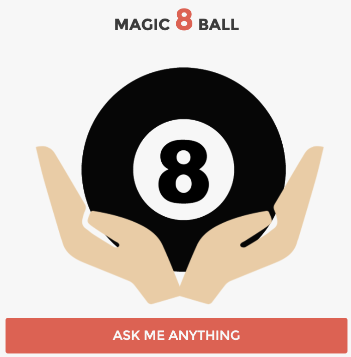

## Magic 8 Ball

### The challenge:

This game is a fun implementation of the Magic 8 Ball game using HTML, CSS, JavaScript and jQuery. The player can ask any yes/no question, and the Magic 8 Ball will provide a mysterious answer.



### How to play

- Click the "ask me anything" button
- Type your yes/no question in the prompt that appears
- Wait for the Magic 8 Ball to reveal the answer

### Implementation details

The JavaScript code utilizes jQuery for DOM manipulation. Here's a brief overview of the key functionalities.

```js
$(document).ready(function () {
  // Apply the 'shake' effect to the Magic 8 Ball
  $("#8ball").effect("shake");

  // Display the Magic 8 Ball answer with a fadeIn effect
  $("#answer").text(answer).fadeIn(3000);

  // Change the image of the Magic 8 Ball to indicate an answer is available
  $("#8ball").attr(
    "src",
    "https://s3.amazonaws.com/media.skillcrush.com/skillcrush/wp-content/uploads/2016/09/answerside.png"
  );

  // Hide the answer initially
  $("#answer").hide();

  // Attach a click event handler to the question button
  $("#questionButton").click(onClick);
});
```

### Resources

[jQuery official website](https://jquery.com/)
